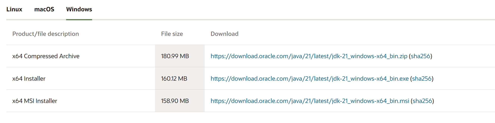
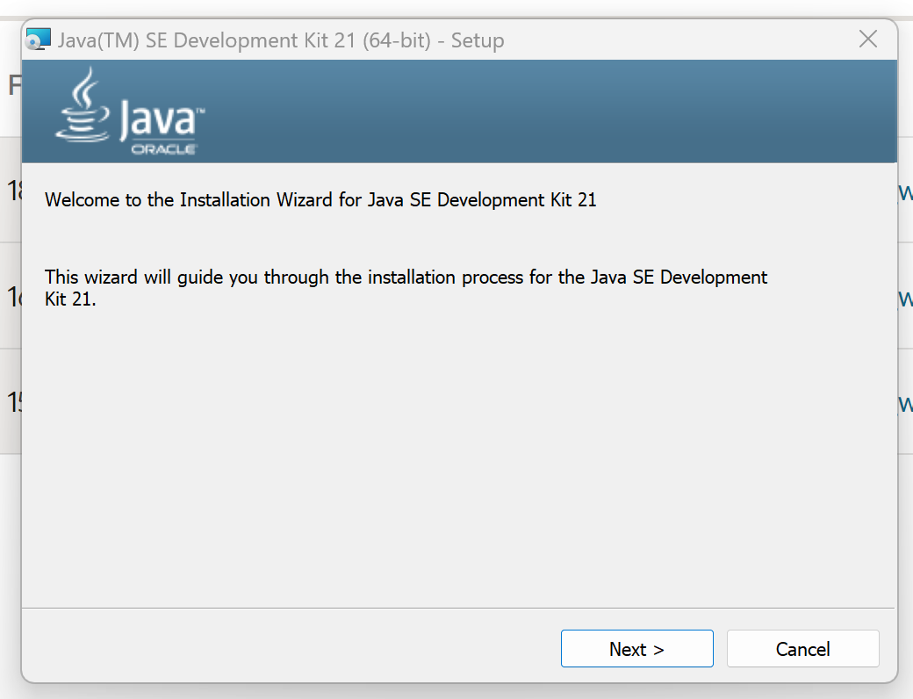
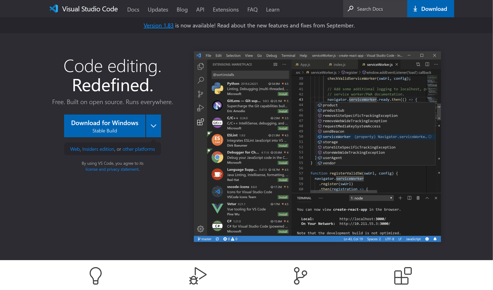
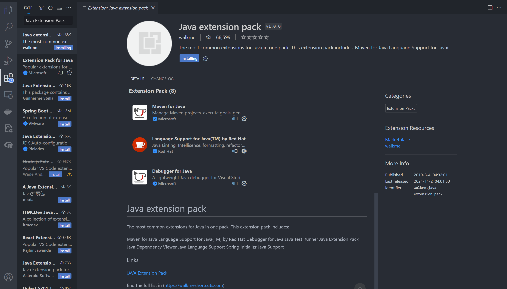
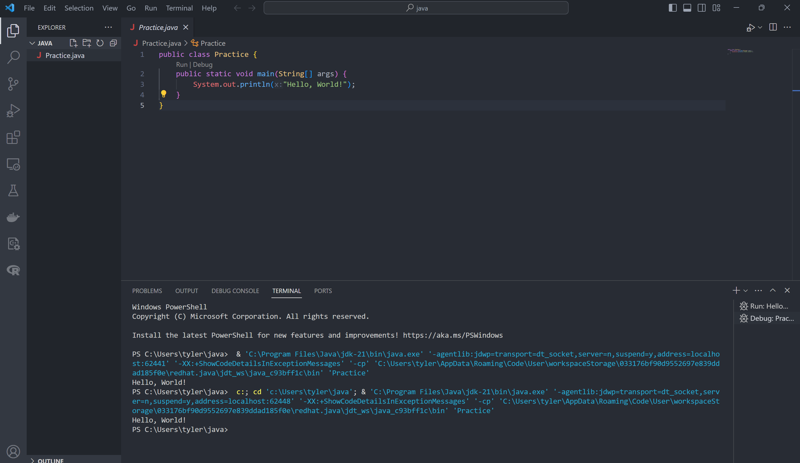

# Java Development Environment Setup with VSCode

Setting up a robust development environment is essential for a productive coding experience. This guide will outline the steps for getting started with Java development in Visual Studio Code (VSCode).

## Installing Java

1. Navigate to the [official Java download page](https://www.oracle.com/java/technologies/javase-jdk16-downloads.html) and select the appropriate version for your OS.

   

2. Follow the installation steps for the downloaded Java Development Kit (JDK).

   

3. Once installed, ensure that the `JAVA_HOME` environment variable points to the JDK installation directory.

## Configuring VSCode for Java Development

1. If not installed already, [download and install VSCode](https://code.visualstudio.com/).

   

2. Launch VSCode and access the Extensions view by clicking on the square icon in the sidebar or pressing `Ctrl+Shift+X`.
3. Search and install the `Java Extension Pack` by Microsoft, which bundles essential Java extensions like Language Support, Debugger, and Test Runner.

   

4. With the extension installed, you're all set to start writing Java in VSCode!

## Verifying Your Setup

1. In VSCode, create a new file with the `.java` extension, for instance, `HelloWorld.java`.
2. Populate the file with a simple Java program.
   ```java
   class HelloWorld {
       public static void main(String[] args) {
           System.out.println("Hello, World!");
       }
   }
   ```
4. Use the built-in features of the Java Extension Pack to run the program and ensure everything works smoothly.

   

## Wrapping Up

You've now successfully set up your VSCode environment for Java development! As you advance in your Java journey, consider exploring additional VSCode extensions that can further enhance your development experience.

[⬅️ Back to Table of Contents](../README.md)
